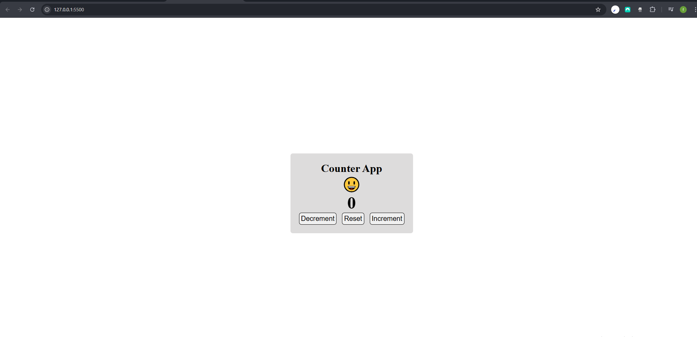
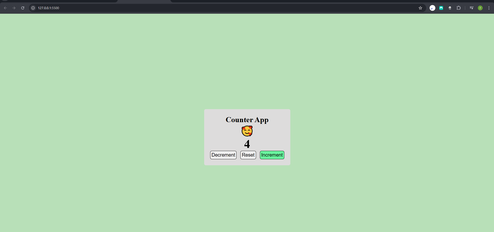
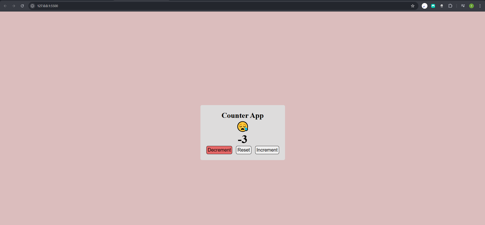

# Counter App 🧮

A simple, interactive, and visually responsive counter application built with **HTML**, **CSS**, and **vanilla JavaScript**.  
Click the buttons to increment, decrement, or reset the count — and watch the background color and emoji change dynamically based on the value!

## 🌐 Live Demo

Try the app live: [https://counter-6397s8lpm-fatin-tawsif-hoques-projects.vercel.app/](https://counter-6397s8lpm-fatin-tawsif-hoques-projects.vercel.app/)

![Counter App Preview]
Initial Stage - 
Increment Stage - 
Decrement Stage - 

## ✨ Features

- **Increment / Decrement / Reset** functionality
- Real-time **emoji feedback**:
  - 😃 at `0`
  - 🥰 when positive
  - 😪 when negative
- **Dynamic background color** that shifts:
  - Green tint for positive counts (gets more saturated as count increases)
  - Red tint for negative counts
  - White background at zero
- Clean, responsive UI with smooth button animations
- Fully **vanilla JavaScript** — no frameworks or libraries

## 🛠️ Technologies Used

- HTML5
- CSS3 (Flexbox, HSL colors, hover & active states)
- JavaScript (DOM manipulation, event listeners, IIFE)

## 📂 Project Structure
counter-app/
├── index.html
├── style.css
└── script.js

💡 How It Works
The counter starts at 0.
Each button click updates the count and triggers the updateBackground() function.

This function:
Changes the emoji based on whether the count is positive, negative, or zero.
Adjusts the background color using HSL values for smooth, dynamic transitions.

